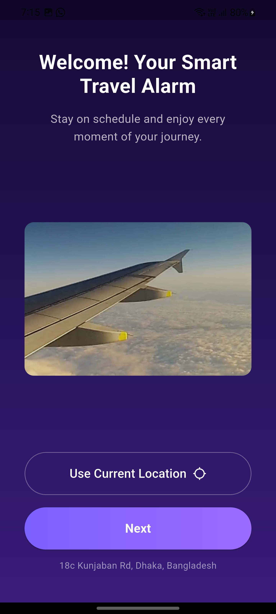
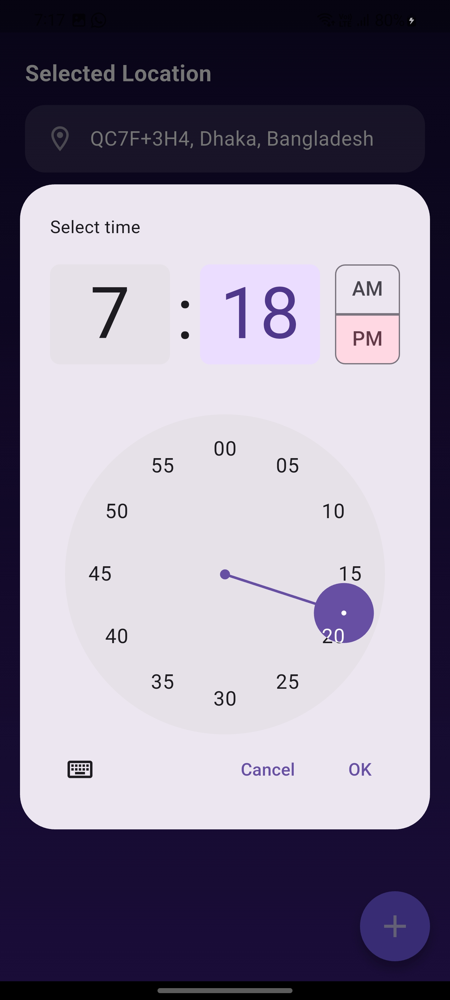
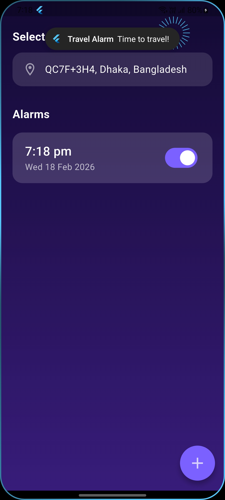

# smart_travel_alarm

A Flutter application that implements a travel-themed onboarding flow, location permissions, and an alarm system with local notifications.

## Features

* **Onboarding Screens:** 3-step introduction with skip functionality.
* **Location Access:** Fetches and displays current location.
* **Alarm System:** Pick time and list scheduled alarms.
* **Notifications:** Local alerts when an alarm goes off.
* **Persistence:** Alarms are stored locally using Hive.

## Project Structure

The project is organized by features to ensure scalability:

```text
lib/
├── common_widgets/   # Shared UI components (buttons, etc.)
├── constant/         # App colors, assets, and routes
├── core.services/    # Hive and Notification service logic
├── features/         # Main app modules (alarm, location, onboarding)
│   └── [feature]/    # controllers, data.model, presentation.screens
├── routes/           # App navigation management
├── app.dart          # Main app widget
└── main.dart         # Entry point

```

##  App Screenshots

<div align="center">
  <table style="border: none;">
    <tr>
      <td></td>
      <td></td>
      <td></td>
    </tr>
    <tr>
      <td></td>
      <td></td>
      <td></td>
    </tr>
    <tr>
      <td></td>
    </tr>
  </table>
</div>

---

## Packages Used

* **State Management:** `Get` (GetX)
* **Local Database:** `Hive`
* **Location:** `geolocator` & `geocoding`
* **Notifications:** `flutter_local_notifications` & `timezone`
* **Date/Time:** `intl` & `flutter_timezone`

## Setup & Running

1. **Fetch Dependencies:**
```bash
flutter pub get
```


2. **Platform Specifics:**
* **Android:** `minSdkVersion` 21 in `build.gradle`.
* **iOS:** Location and notification keys added to `Info.plist`.


3. **Run App:**
```bash
flutter run
```


## Demo Link

* **Loom Video:** [https://www.loom.com/share/3c05587b65c34ab49067a750cd140926]